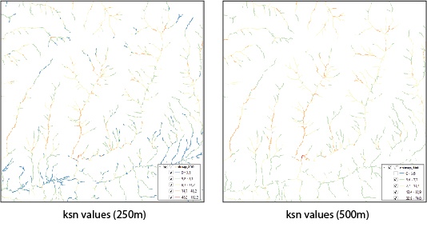

# topopy
>- Topographic analysis with Python


## Purpose

The Topopy library provides some useful Python classes and functions for topographic analysis, drainage network extraction and computation of important geomorphic indices from Digital Elevation Models (DEMs). The main goal of topopy is to provide a simple way to compute geomorphic indices for those researchers who are not familiar with complex computational techniques. This library aims to pave the way for tectonic geomorphologists who do not have deep programming skills, but who can play a very relevant role in the interpretation of these analyses in terms of their relationship with geology, tectonics and associated hazards. 

This library is constantly growing, and we will include more analysis and functions in future versions. 

## Installation

The library can be installed via pip via [pip][pip_link] on Linux, Mac, and Windows.
Install the package by typing the following command in a command terminal:

    pip install topopy

To install the latest development version via pip, see our [github project page][github_link]. 


## Citation

We are preparing a 
> Pérez-Peña et al.:
> Topopy, a python library for topographic analysis in Python and QGIS.
> [In preparation]

### Tutorials and Examples

To get an overview of how topopy works, we offer some tutorials to perform some of the most common tasks that can be done with it. 

- [Extraction of a drainage network][tut1_link]
- [Calulation of Chi-maps and ksn values][tut2_link]
- [Plot single channel profiles][tut3_link]
- [Create channels from a polyline shapefile][tut4_link]
- [Create channels from a drainage basin][tut5_link]

The associated python scripts are provided in the `docs` folder.

### Examples

#### Creation of a Chi Map from a Digital Elevation Model

This is an example of how to generate a Chi Map in vector format from a DEM

```python
from topopy import DEM, Flow, Network
# Load the DEM and create the Flow and the Network
dem = DEM("data/jebja30.tif")
fd = Flow(dem)

# Create a Network object with a threshold of 1500 cells and reference m/n of 0.45
net = Network(fd, 1500, thetaref=0.45)

# Create a Chi Map in vector format for segments of 250 and 500 m
net.get_chi_shapefile("data/chiMap_250.shp", 250)
net.get_chi_shapefile("data/chiMap_500.shp", 500)
```

<p align="center">

</p>

#### Analysis of different values of m/n for a basin

This is an example we analyze the best m/n value for Chi anlysis in a sample small basin

```python
from topopy import Grid, DEM, Flow, Network, BNetwork
import matplotlib.pyplot as plt 

# Load the DEM and create the Flow and the Network
dem = DEM("data/jebja30.tif")
fd = Flow(dem)

# Create a Network object with a threshold of 1500 cells and reference m/n of 0.45
net = Network(fd, 1500, thetaref=0.45)

# Load the Basins
basins = Grid("data/basins")

# Generate the BNetwork object for the basin with id=2
bnet = BNetwork(net, basins, bid =2 )

# Check different m/n values for chi analysis
mn_vals = [0.25, 0.3, 0.35, 0.4, 0.45, 0.5]

fig = plt.figure(figsize=(17, 10))

for n, mn in enumerate(mn_vals):
    bnet.calculate_chi(mn)
    ax = fig.add_subplot(2, 3, n+1)
    bnet.chiPlot(ax)
    ax.set_title("Chi plot (m/n = {})".format(mn))
    ax.set_xlabel("$\\chi$ (m)")
    ax.set_ylabel("Elevation (m)")
    
plt.tight_layout()
```

<p align="center">

</p>

## Requirements:

- [GDAL](https://pypi.org/project/GDAL/)
- [NumPy >= 1.14.5](https://www.numpy.org)
- [SciPy >= 1.1.0](https://www.scipy.org/scipylib)
- [scikit-image >= 1.0.0](https://scikit-image.org/)
- [matplotlib >= 3.0.0](https://matplotlib.org/)

## Contact

You can contact me via <geolovic@gmail.com> <vperez@ugr.es>.

## License

[LGPLv3][license_link] © 2022

[pip_link]: https://pypi.org/project/gstools
[github_link]: https://github.com/geolovic/topopy
[tut1_link]: docs/topopy_tutorial_01.ipynb
[tut2_link]: docs/topopy_tutorial_02.ipynb
[tut3_link]: docs/topopy_tutorial_03.ipynb
[tut4_link]: docs/topopy_tutorial_04.ipynb
[tut5_link]: docs/topopy_tutorial_05.ipynb